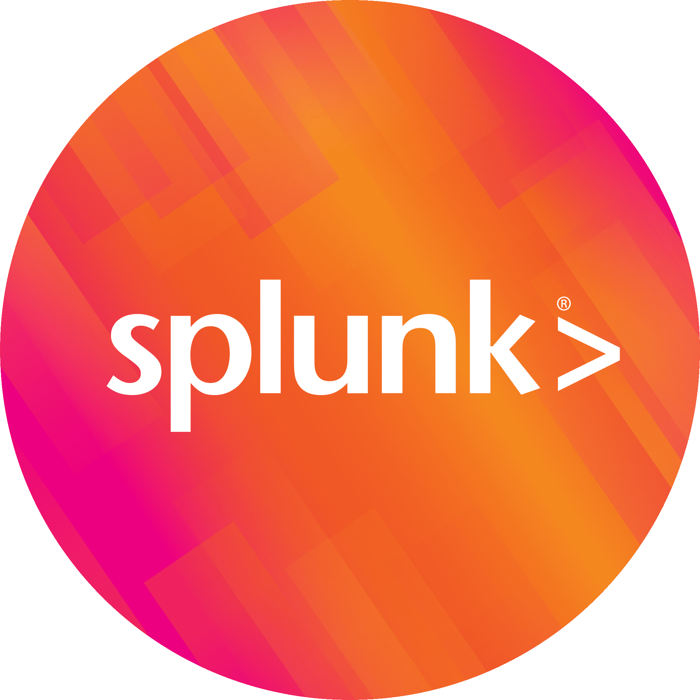
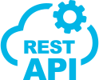

# 👋 About Me
Welcome to my GitHub profile! I'm @derchrischkya, a name that might not immediately ring a bell – and that's perfectly alright. Feel free to explore my repositories, and if you have any questions, suggestions, or just want to connect, don't hesitate to get in touch. You can send a virtual carrier pigeon my way, or simply reach out to me through the contact options provided below.

When I'm not immersed in the world of data engineering, you'll find me following the well-trodden path of a typical IT aficionado, endlessly fascinated by the wonders of technology and on a ceaseless quest for knowledge.

Let's collaborate on captivating projects and make the digital realm a better and more amusing place, one witty line of code at a time!
<br>
## 🛠️ My Toolkit
<p align="center">
  
  
  
  
  
  
  
  
  
  
</p>
<br>

## 📚 Recent Learnings
<p align="center">
  
  
  
  
</p>
<br>

## 📊 GitHub Statistics
<div style="background-color: white; padding: 10px; border-radius: 5px;">
  <p align="center" block="inline">
    
    <a href="https://github.com/anuraghazra/github-readme-stats">
      
    </a>
  </p>
</div>
<br>

## 💻 Weekly Workload
<!--START_SECTION:waka-->

```txt
YAML         5 hrs 47 mins   ██████████████████▒░░░░░░   73.28 %
Other        1 hr            ███▒░░░░░░░░░░░░░░░░░░░░░   12.69 %
Python       34 mins         █▓░░░░░░░░░░░░░░░░░░░░░░░   07.24 %
XML          9 mins          ▒░░░░░░░░░░░░░░░░░░░░░░░░   01.95 %
Markdown     6 mins          ▒░░░░░░░░░░░░░░░░░░░░░░░░   01.37 %
```

<!--END_SECTION:waka-->

## 📫 Contact Me
<p align="center">
<a href="https://linkedin.com/in/christoph-richter-aabb2015a" target="_blank">
  
</a>
<a href="mailto:christoph.richter1997@gmail.com" target="_blank">
  
</a>
</p>
